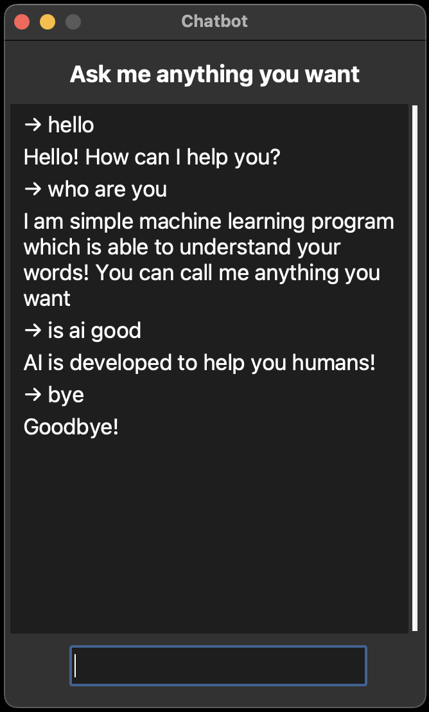

# Chatbot with Machine Learning in Python with GUI made with tkinter
> Chatbot has been made with TFLearn, NLTK and tkinter Python modules and is using machine learning to answer questions. All of that is inside a simple GUI app.

## General Information
- The purpose of this project was to start my journey with Machine Learning and create useful app.

## Technologies Used
- Python 3.9
- Python built-in 'tkinter' module
- TFLearn Python module
- NLTK Python module

## Usage
App was trained only on a small amount of data located in the intents.json file. After changing/adding something there, you have to retrain the model.

After opening app, ask question and click enter/return to send it.

## Screenshots

App is based on TechWithTim Machine Learning, Neural Networks, and Deep Learning Chatbot tutorials

## Contact
Feel free to contact me via my mail michvlbbb@gmail.com
